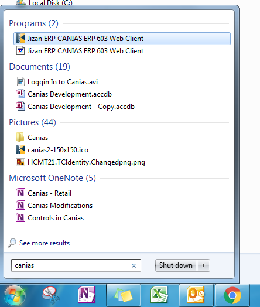

Logging in to Canias
************************

Overview
---------
This document presents the simple steps of launching the ERP application, describes the parameters in the login screen.

Launching the Application
-------------------------
* To launch the application search the application in Start Menu by typing in 'Canias'. 

	Alternatively, double click the desktop icon, click the launcher in the taskbar, if available.

.. image:: login_taskbar.png
    :align: center
    :scale: 75%
    :alt: Launch using Taskbar

* The application might take a few seconds to load during the first run upon fresh boot. This is because the application has to go through various stages of checking for updates, loading from cache and creation of the virtual java environment. Messages like 'Downloading Application','Verifying Application' are typically encountered. Kinldy wait until the following login screen is shown.

.. image:: login_dialog.png
    :align: center
    :scale: 75%
    :alt: Launch using Taskbar

