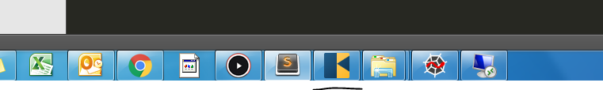
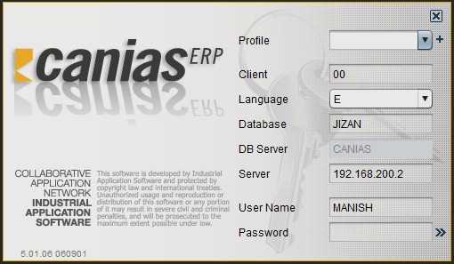

Logging in to Canias
************************

Overview
---------
This document presents the simple steps of launching the ERP application, describes the parameters in the login screen.

Launching the Application
-------------------------
To launch the application search the application in Start Menu by typing in 'Canias'. 

.. image:: login_start.png
    :align: center
    :scale: 75%
    :alt: Launch using Start Menu

Alternatively, double click the desktop icon, click the launcher in the taskbar, if available.

The application might take a few seconds to load during the first run upon fresh boot. This is because the application has to go through various stages of checking for updates, loading from cache and creation of the virtual java environment. Messages like 'Downloading Application', 'Verifying Application' are typically encountered. Kinldy wait until the login screen is shown.

Logging In
----------
Although the only details an end user would have to fill in for login is 'Username' and 'Password', the input parameters that can be defined in the login dialog box have been described below:

.. warning:: Do not make any changes to these parameters unless you are confident in what you're doing. Incorrect parameters will lead to failures in logging into the system.

* **Profile** : Different combinations of login parameters can be stored as independent profiles for quick access. Consider for example a user who would have to switch between 'TEST' and 'LIVE' databases regularly. The user would create two profile for this purpose and easily choose the desired profile from the dropdown instead of having to input all the login parameters during the switch.
* **Client** : This is always '00' for us.
* **Language** : The language of Canias ERP. Other languages might not work correctly as the customizations made in Canias might not have been translated to other languages.
* **Database** : The name of database to be used. This should be set to 'JIZAN'
* **DB Server** : This is always 'CANIAS'
* **Server** : This is the ip address of our Canias Application Server. This should be set to '192.168.200.3'
* **Username** : The username
* **Password** : The password

Enter the username and password that has been asissned to you in the 'User Name' and 'Password' fields respectively. Hit the 'Enter' key or click on the double right arrow beside the password field. The application window shall appear within a few seconds.

Common Login Errors
-------------------
There might be several reasons that could lead to failure in logging in to the system. Some of the common errors have been discussed below:
.. info:: This section is to be updated with the list of common login failures and the possible reasons behind them.