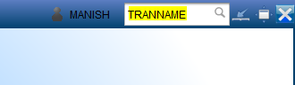

Opening a Transaction
*********************

This document presents the basic steps in launching of a Transaction in Canias.

Using the Input Box
-------------------
To launch the transaction enter the name of the transaction in the input box located at the top right corner of Canias application screen.

After typing in the transaction name, press the 'Enter' key.

.. note:: Alternative methods for opening of transaction includes the use of 'Favorite Shortcuts' and the 'Navigation Bar'. As these alternate methods are not commonly used, this guide shall be updated for inclusion of those methods in the future.