FINT61 - Account Transactions
*****************************

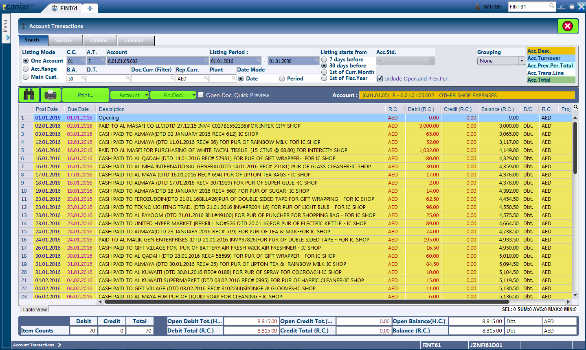

Overview
---------
FINT61 - Account Transactions is a module that substitutes similar modules in other ERP systems like Account Ledgers. The module provides the listing of transactions for a particular account or a range of given accounts.

Purpose
-------
* View transactions related to a single account.
* View transactions related to a range of accounts.

Filters and Shortcuts
---------------------
The module includes filters which allows the end user to select listing layouts, narrow down the search results and hide / unhide additional information related to the transactions.

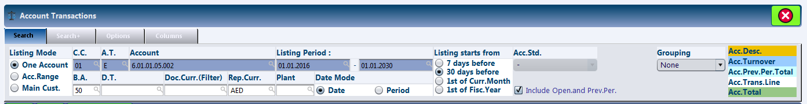

As seen in the screenshot above, the filters for FINT61 are provided in multiple tabs as : Search, Search +, Options and Columns. These will be explained in detail.

Search
^^^^^^
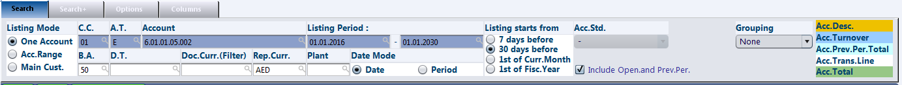

The module provides three choices for the display of account transactions.

* **One Account** - This option is used to view the account transactions for a single account.
* **Acc. Range** - This option is used to view the transactions for a range of accounts. This is typically useful when reviewing transactions for similar account heads, like 'Staff Salary', 'Staff Medical Expense', etc. in a single screen.
* **Main Cust.** - This option is similar to One Account option.

Depending on the listing mode selected, we would have to choose either a single account or a range of accounts as input.

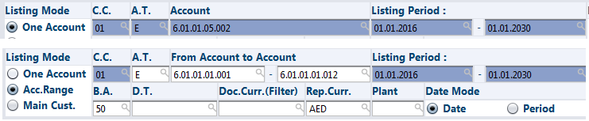

To select the account, click on the small magnifying glass icon within the account input box.

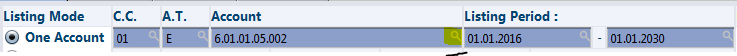

As we click on the icon, the system displays an additional account selection dialog. This dialogs has its own filters that help narrow down the desired account.

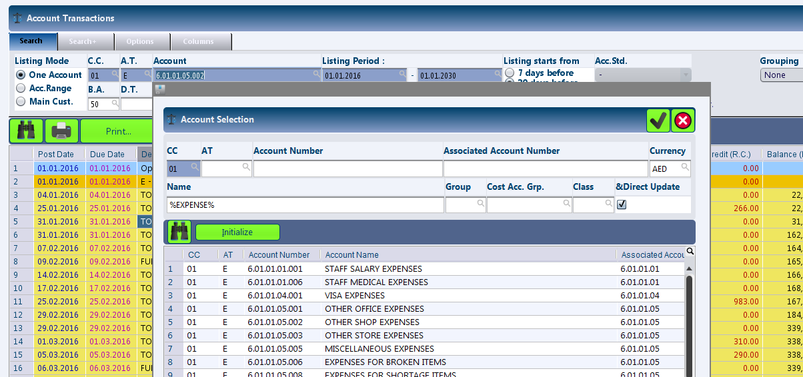

The most frequently used filters in this dialog are 'Account Number', 'Name'. As seen in the screenshot, we are searching for all accounts with the word 'EXPENSE' in them. Alternatively, we can simply press the search button without entering any filter criterias to get the list of all accounts available.

Once the desired account is found, simply select the entire row for the expense and click on the 'OK' (seen as checkmark icon) button. Alternatively double click on the row for the desired account.

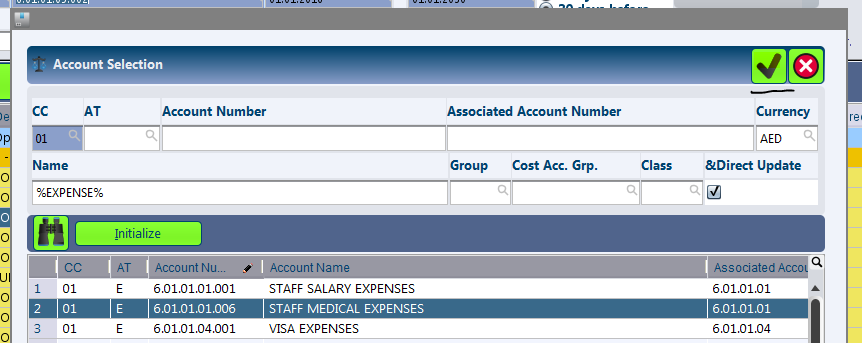

When using the 'Acc. Range' as listing mode, the accounts can be selected using the same steps as above, with the step repeated for each start and end accounts in the range.

In either of the above modes, following are fixed mandatory inputs:

* **C.C (Mandatory)** - The company for which we need to view the transactions.
* **B.A (Mandatory)** - The business area for which we need to view the transactions.
* **D.T** - The finance document type. This filter can be used to view for example only the Bank Payment documents that affect a particular account by keying in 'BP'.
* **Doc. Curr (filter)** - This filter can be used to view transactions that were recorded at the selected currency.
* **Rep. Curr. (Mandatory)** - Defines the currency for the listing of transactions.
* **Plant** - The plant for which transactions are to be displayed. This option is rarely used.
* **Date Mode** - The module allows transactions to be fitlered based on either dates or periods (months). Based on the selection made for date mode, the inputs for Listing Period changes.
* **Listing Period (Mandatory)** - When the date mode is Date, the start and the end date are to be supplied as listing period. When the date mode is period, the start and end periods (months) are to be supplied.
* **Listing Starts From** - This group of checkboxes can be used to change the date range automatically without having to define the start and end date. Any change on the checkboxes is reflected on the dates.
* **Include Open. and Prev. Per** - This filter defines whether the opening balances will be displayed in the listing.
* **Grouping** - This dropdown provides different fields / parameters to which the information displayed can be grouped. For example, selection of Daily would group the transactions on a daily basis, showing the total count, debits and credits.

Search +
^^^^^^^^^
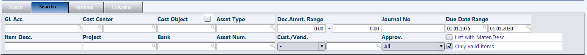

* **GL Acc.** - This field is typically unused as the account selected is the same as the gl account for most of the accounts. Some exceptions to this are 'PDC Receivables', 'Perfume Sales', etc.
* **Cost Center** - In case cost centers have been defined for the company and they are being mapped with the transactions at the time of data entry, this filter can help narorow down transactions to specific cost center. Clicking at the zoom icon for the input brings up an additional dialog for cost center selection.
* **Cost Object** - Similar to Cost Center, this field can be used to track transactions that are related to a cost object in case it is supplied at the time of data entry. There are two cost objects that can be assigned to any transaction i.e. primary or secondary. If the checkbox next to this cost object label is selected, the system neglects the secondary cost object.
* **Asset Type** - This can be used to narrow down information for a particular asset type. Again, this has to be defined during data entry.
* **Doc. Amnt. Range** - As the title suggests, we can define the max and min criterias for display of the transactions.
* **Due Date Range** - The primary date range we provide in the Search Tab of the filters looks up transactions based on document dates. Instead, if the due dates are to be used, this range can be customized.
* **Item Desc.** - This field can be used to narrow down transactions with its narration used during data entry.
* **Project** - Can be used to filter transactions that are related to a specific project.
* **Bank** - Can be used to filter transactions that relate to a specific bank.
* **Asset Num.** - Can be used to filter transactions that relate to a specific asset.
* **Cust. / Vend.** - Can be used to filter transactions by the customer / vendor account number.
* **Approv.** - Can be used to filter transactions based on its approval status. This is only useful if the system approval of transactions is being used.

Options
^^^^^^^
This tab provides a few options for the display of transactions.

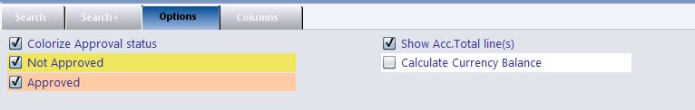

* **Colorize Approval Status** - If the option is checked, the transactions are highlighed with different colors based on its approval status.
* **Show. Acc. Total Line(s)** - If the option is checked, the system displays account total lines after each accounts (this is particularly useful when viewing transactions under 'Acc. Range' mode).

Columns
^^^^^^^
As the name suggests, this tab provides checkboxes which can be used to show / hide specific columns that provide additional information related to the transactions.

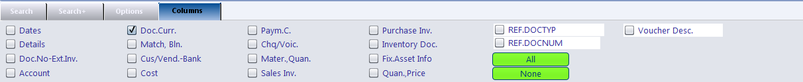

* **Dates** - Shows / hides Doc.Date and Curr. Date
* **Details** - Shows / hides additional information on Accounting Standard for the particular transaction (this is only useful if a company maintains books under multiple account standards), Business Area, Approval Status (only useful is the system approval is used), Can. (the document cancellation status, 0 for not cancelled).
* **Doc.No-ExtInv.** - Shows / hides information on finance document type, finance document number, item number (the position of transaction within the finance document), and the external invoice number.
* **Account** - Shows / hides the account to which the transaction relates to. This is typically useful when using account range as the list mode.
* **Doc.Curr.** - Shows / hides the document currency for the transaction.
* **Match, Bln** - Shows / hides the total matched amount for the transaction and the remaining balance to be matched.
* **Cust/Vend.-Bank** - Shows / hides the customer / vendor and bank information (if available)
* **Cost** - Shows / hides the project, cost center and cost object information (if available)
* **Payment C.** - Shows / hides payment details.
* **Chq./Voic.** - Shows / hides the cheque details.
* **Materi., Quan.** - Shows / hides the material information (where applicable)
* **Sales Inv.** - Shows / hides the referenced sales invoice from the sales module (where applicable)
* **Purchase Inv.** - Shows / hides the referenced purchase document from purchase module (where applicable)
* **Inventory Doc** - Shows / hides the inventory document related to the transaction.
* **Fix. Asset Info** - Shows / hides the fixed assets details (where applicable).
* **Ref.DocTyp** - Shows / Hides the reference document type (applicable for intercompany transaction)
* **Ref.DocNum** - Shows / Hides the reference document number (applicable for intercompany transaction)
* **Voucher Desc.** - Shows / Hides the voucher long description.

Searching for Account Transactions
---------------------------------
* Select the desired listing mode 'One Account' or 'Acc. Range'
* Provide the mandatory criterias like company, business area, account and date range.
* Press the 'F3' button or click the 'Search' button.

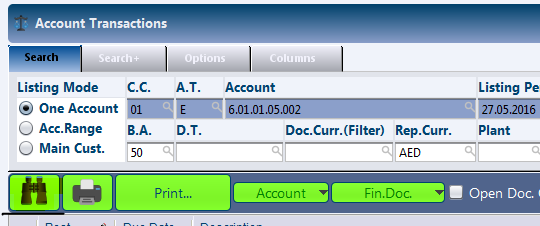

Depending on the search filters provided, the system looks up the account transaction and lists them in the result window. In case required, select additional columns to be displayed by selecting the checkboxes provided in the 'Columns' tab.

Understanding the Result Table
------------------------------

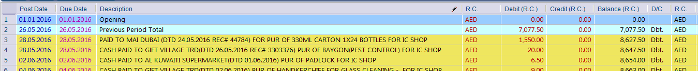

* **Post Date** - The date when the document was posted in the system.
* **Due Date** - The due date of the document.
* **Description** - The description of the transaction.
* **R.C** - Reporting Currency
* **Debit(R.C)** - The debit amount (displayed in the reporting currency selected)
* **Credit(R.C)** - The credit amount (displayed in the reporting currency selected)
* **Balance(R.C)** - The cumulative balance of the account (displayed in the reporting currency selected)
* **D/C** - Indicates whether the transaction is a debit or credit to the account.

In addition to the columns discussed above, the system displays additional columns as per the selection in the 'Column' filter tab. This has been discussed in the earlier segment of this manual.

Document Quick Preview
----------------------
FINT61 provides an easy way to view the details of any transaction that appears in the search listing. This quick preview of the full transaction displays all the details of the transaction at an item level as shown below:

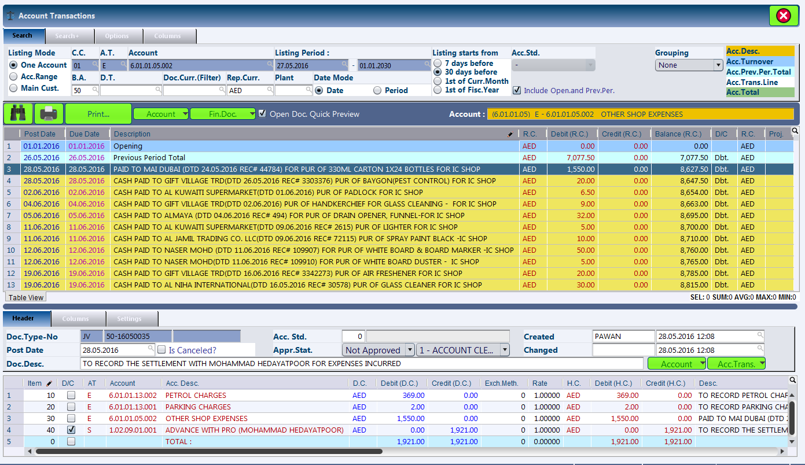

To enable quick preview of the finance document, tick the 'Open Doc. Quick Preview' checkbox. This is adjacent to the search and print buttons as seen below.

.. image:: fint61_quickpreviewbtn.PNG
	:align: center
	:scale: 75%
	:alt: FINT61 Quick Preview Button

Thereafter, clicking on a particular row in the result grid displays the full details of the related finance document in the lower part of the screen. This quick preview can be hidden anytime by unchecking the 'Open Doc. Quick Preview' checkbox.