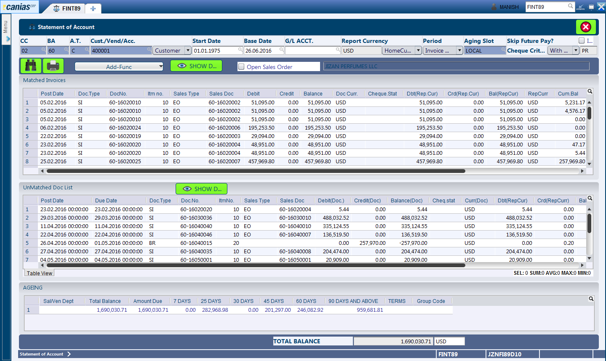
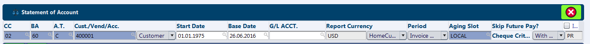
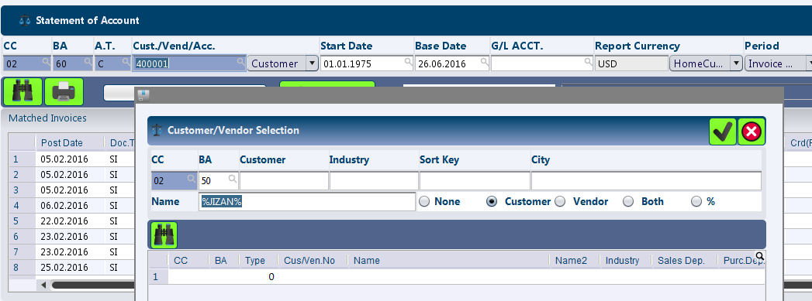
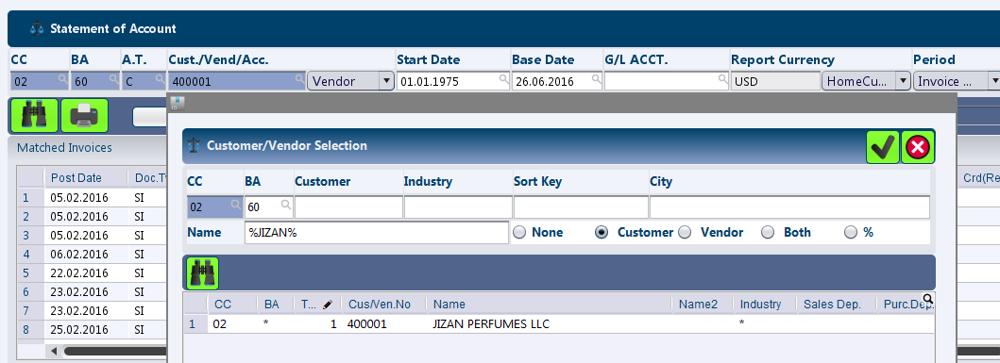
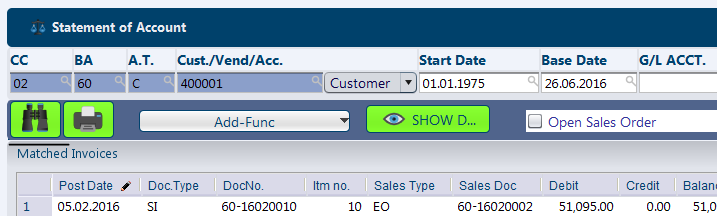
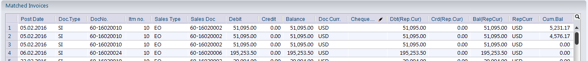

FINT89 - Account Transactions
*****************************

Overview
---------
FINT89 - Statement of Accounts is used to monitor the outstanding balances from customers or to the vendors. Furthermore, this module can also be used to monitor the account balances.

Purpose
-------
* View Statement of Account for Customer / Vendor / Accounts
* Print the 'Oustanding Statement' for Customer / Vendor / Account balances

Filters and Shortcuts
---------------------
The module includes a few mandatory filters to define the account parameter, and a few additional filters that have an impact on how the report is displayed.

* **CC** - The company.
* **BA** - The business area.
* **A.T.** - The account type.
* **Cust/Vend/Acc.** - The customer / vendor / account number for which we need to view the transaction. This contains an adjacent dropdown menu which defines whether the customer / vendor or account statement is being searched.
* **Start Date** - The start date for the transactions for which we want to see the outstanding report.
* **Base Data** - The date which will form the basis for calculation of age breakdown.
* **G/L Acct.** - In some cases, the transactions for customer / vendor are posted to different GL accounts. In such cases, this fitler can be used to select a branch of transactions for the customer / vendor.
* **Reporting Currency** - Defines the currency at which the statement of account is displayed. This filter also contains an adjacent dropdown which provides a choice between the home currency and other currency (which needs to be defined explicitly).
* **Period** - This dropdown defines how the Start Date is interpreted. Options available are 'Invoice Date', 'Document Date' and 'Due Date'. Based on the selection, the period for transactions is interpreted and the search results displayed.
* **Ageing Slot** - The age breakdown provided by the module can be customized by defining different period ranges in the master configuration. This filter provides the list of all available ageing slots.
* **Cheque Criteria** - This filter defines if the PDC transactions are to be included or excluded from the statement of account. This can be done via selection from the adjacent dropdown.
* **Open Sales Order** - By default the statement of account only displays sales invoices (LI / EI / CI)  in the listing. However, if the open sales orders (that are pending for tranformation to invoice) are to be included in the statement of account, this checbox can be ticked.

Viewing the Statement of Account
---------------------------------

* Select the desired Company and Business Area.

As the module is used to view statement of accounts for either of 'Customer', 'Vendor' or 'Account', we will look at next step for each of the cases individually:

Customer Statement
^^^^^^^^^^^^^^^^^^
* Select 'Customer' as the droption option from Cust / Vend / Acc.
* Click on the magnifying glass icon inside the Cust / Vend / Acc input. This brings up an additional dialog for selection of the required customer account.

As seen in the screenshot above, the dialog provides filters like 'Customer' (customer number), 'City' and 'Name' (any part of the company name can be entered here enclosed by '%'s. For example: to search for Jizan, we can use '%JIZAN%').

Once the desired customer is found, we can double click on the row for the customer or select the entire row and click the 'OK' (seen as checkmark icon) button.

Vendor Statement
^^^^^^^^^^^^^^^^
* Select 'Vendor' as the droption option from Cust / Vend / Acc.
* Click on the magnifying glass icon inside the Cust / Vend / Acc input. This brings up an additional dialog for selection of the required vendor account.

As seen in the screenshot above, the dialog provides filters like 'Customer' (vendor number), 'City' and 'Name' (any part of the company name can be entered here enclosed by '%'s. For example: to search for Jizan, we can use '%JIZAN%').

Once the desired vendor is found, we can double click on the row for the vendor or select the entire row and click the 'OK' (seen as checkmark icon) button.

* Change the additional filters as required and make sure that all mandatory fields are filled.
* Press the 'F3' button or click the 'Search' button.

Understanding the Result Table
------------------------------
The search result now displays the information related to the selected customer / vendor / account in three different result grids: Matched Invoices, Unmatched Doc List and Ageing Breakdown.

Matched Invoices
^^^^^^^^^^^^^^^^
The first result grid 'Matched Invoices', displays all documents that are already matched (in other words, already settled via payment or any other transaction). 

* **Post Date** - The date when the document was posted in the system.
* **Doc. Type** - The document type. This typically is Sales Invoices (SI) for customers and Bank Payments (BP) for vendors.
* **Doc. No** - The document reference for the transaction.
* **Itm. No.** - The unique line item for the transaction within the source document.
* **Sales Type** - This column displays the sales order type in case we are viewing the statement for customer and the doc type is a sales invoice.
* **Sales Doc** - This column displays the sales order number in case we are viewing the statement for customer and the doc type is a sales invoice. 