HCMT54 - Biometric Information
******************************

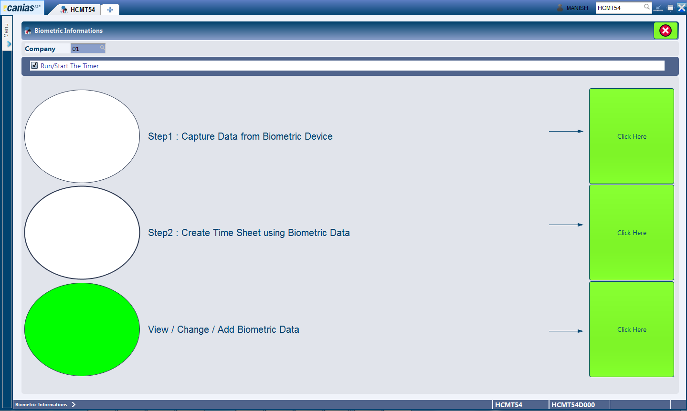

Overview
---------
HCMT54 is the module that is related to the management of attendance data for staffs.

.. note:: The documentation for this module is currently incomplete.

Purpose
-------
* Adding of Biometric Records

Adding Biometric Records Manually
---------------------------------
In cases where the punch in / out records are to be feeded into the system manually, Canias provides a way to create a new punch in / out record. The steps required have been presented below:

* Open HCMT54.
* Select the third option from the available options i.e. View / Change / Add Biometric Data as shown below.

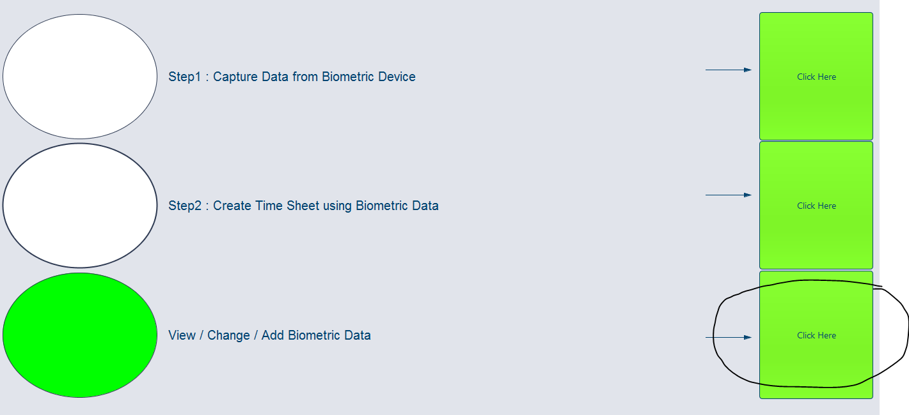

* Click the 'Add Button', visible with the + (Plus) sign.

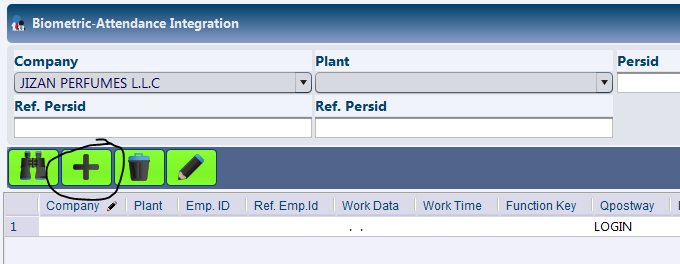

* Select the Person ID for whom the record is to be created. This can be done by clicking the small 'Magnifying Glass' icon shown in the Persid column.

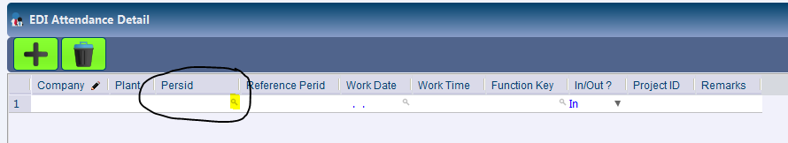

* Search for the Person ID by keying in the search filters or directly click the 'Search Button' to bring up a list of all staffs.

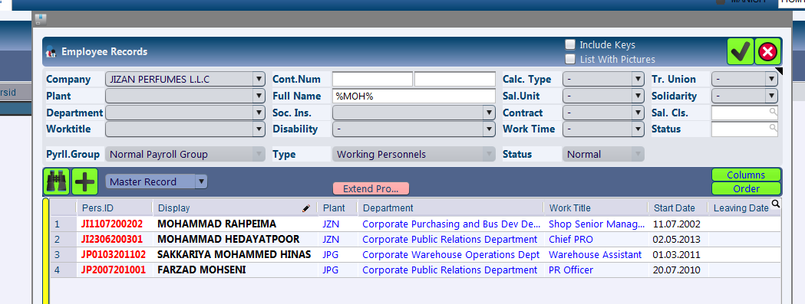

* To choose a employee simply double click on the row with the employee name or select the row and click the 'Ok' button, visible as 'Checkmark / Tick' sign.

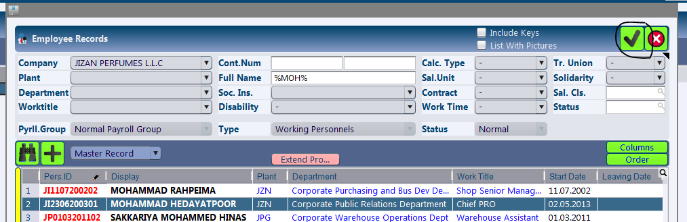

* After the selection is made, the fields Company and Plant are automatically updated with the selected staff's company and plant.

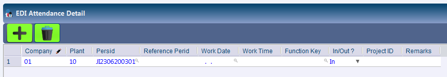

* Enter the name of the Person in the 'Reference Perid' field.
* Enter the relevant date in the 'Work Date' field. This should be in DD.MM.YYYY format. Alternatively the date can be selected by clicking the 'Magnifying Glass' icon in the same field.
* Enter the time in the 'Work Time' field. This should be a 24 hrs time with the format HH:MM. For exampl: 10:54, 19:35.
* Select the Function Key to be used for this particular record. Clicking the 'Magnifying Glass' icon in the 'Function Key' column brings up the function key selection dialog.

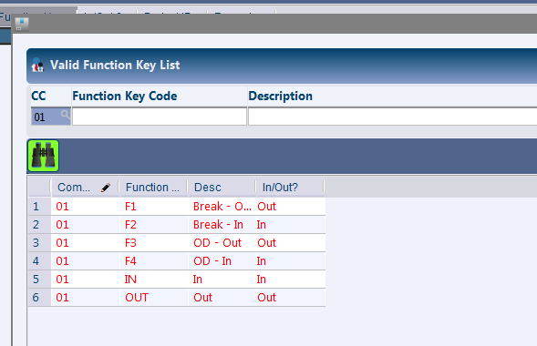

* Select the desired function key by double clicking on the row or by clicking the row with desired key and then clicking the 'Ok' button visible as 'Checkmark / Tick'.

* Select the correct In / Out option from the In / Out? column.

* Leave the Project ID blank.

* In case available, enter remarks in the 'Remarks' field.

Additional records can be created by clicking the 'Add' button visible as '+ (Plus)' icon.

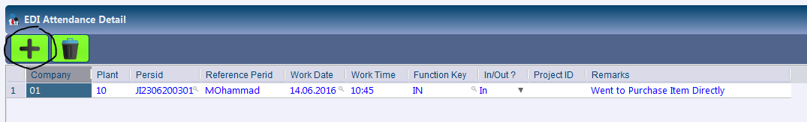

* After the desired records have been added, click on the 'Save' button visible as 'Save' icon.

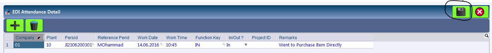

* The system displays a success message upon saving.

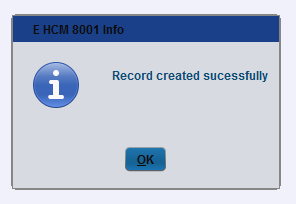

* Verify the data entered by using the HCMTS module.

