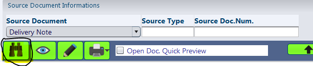

INVT05 - Inventory Documents
****************************

Overview
---------
INVT05 - Inventory Documents is basically an Inventory Audit module, which allows the users to view the listing of all inventory movements (can be reffered to as documents, as a document is created for each inventory movement) and the comprehensive details of any movement as required. The module could also be used as alternative to viewing the Stock Ledgers.

Purpose
-------
* Monitoring / Tracking of Inventory Movements on a batch, document or individual material's level
* View / Edit the Finance Cost Value of an item for a specific movement
* Printing of Bar-Code labels for materials that are part of a specific inventory movement
* Updating of Pack Prices for materials that are poart of a specific inventory movement

Filters and Shortcuts
---------------------
The module includes filters primarily aimed at narrowing down the inventory movements listed by the system.

.. image:: invt05_filters.PNG
	:align: center
	:scale: 75%
	:alt: SITIQ window

* **Company (Mandatory)** - Company for which the inventory documents are to be listed.

* **Plant** - The plant for which inventory documents are to be listed.

* **Warehouse** - The specific warehouse for which inventory documents are to be listed.

* **Stock Place** - The specific stockplace for which inventory documents are to be listed.

* **Special Stock** - This field is related to the nature of stock. In our case, this is always Normal i.e. '*'.

* **Batch Number** - Batch Number is a unique number generated by the system when items are received against the Purchase documents. The batch number generated is linked to all the subsequent movements of the inventory and thus can be used to track the movement of items that were part of a specific purchase.

* **Vendor Num.** - Vendor Account number, the purchases from whom are to be listed.

* **Doc Date Interval** - The period for which inventory documents are to be listed.
.. _invdoc-types:
* **Doc. Type** - The document type of the Inventory Movement. The most common inventory document types has been listed below:

	* AI - Automatic Inventory Issue, which is used for cash / retail sales movement
	* II - Intercompany Issue, the issue of inventory in an intercompany transaction
	* IR - Intercompany Receipt, the receip tof inventory in an intercompany transaction
	* LI - Local Issue, the issue of goods against Local Delivery Note
	* EI - Export Issue, the issue of goods against Export Delivery Note
	* LR - Local Receipt, the receipt of goods against Local Purchases
	* WR - Warehouse Receipt, the receipt of goods against Import Purchases
	* MI - Manual Issue, for issue of inventory without any related document
	* RD - Return Document, for items received as Sales Returns
	* SC - Stock Counting, for inventory adjustments
	* TO - Transfer Order, for movements against Transfer Orders

* **Doc. Number** - The document number for particular inventory movement.

* **Material** - Material Code for the item.

* **Material Name** - Material name for the item.

* **Postway** - The type of inventory movement i.e. Receipt or Issue. Both of the movements can be viewed by choosing 'Both'.

* **Cancel** - If the checkbox is selected, the system displays list of inventory documents that have been cancelled.

As explained here, a inventory movement in Canias is always linked to the source document which could be purchase, sales, transfer orders, etc. This filter option allows the user to narrow down the inventory listings to movements that were generated from a specific source document. Typically the following options are selected from the dropdown.

* **Purchase Order** - Upon selection of this option, three new input fields are presented. The inventory movements can then be narrowed down to a particular purchase order type, purchase order number or the delivery number.

* **Delivery Note** - Upon selection of this option, two new input fields namely Source Type and Source Doc. Num are presented. These input fields can be used to track inventory movements for a particular delivery note.

In addition to the normal filters, the module provides shorcuts to different date configurations. The starting date in Doc. Date Interval is changed to match the current selection as the different options are clicked.

Searching for Inventory Movements
---------------------------------
* Enter the required filter criterias in the filter boxes.
* Press the 'F3' button or click the 'Search' button.

Depending on the search filters provided, the system looks up the stock information and lists them in the result window.

Understanding the Result Table
------------------------------
The module always displays the details up to the batch level, with the information as explained below:

* **Document Date** - The date when the inventory movement document was created.
* **DType** - The inventory document type. The major document types has been listed :ref:`here<invdoc-types>`.
* **DocNumber** - The inventory document number.
* **Item** - As the result set presents item at the material's batch level, there are cases where the same item might appear in an inventory document with two different batch numbers. These two rows in the inventory documents are identified by this reference 'Item Number'. This number is unique for each items in the inventory movement document.
* **Material** - The material code.
* **Material Desc** - The material description.
* **Plant** - The plant to which the inventory movement relates to.
* **WH** - The warehouse to which the inventory movement relates to.
* **StockPlace** - The stockplace to which the inventory movement relates to.
* **SStock** - The special stock reference. This is always '*' for us.
* **BatchNumber** - The batch number reference for this inventory movement. This is found to be '*' in case of movements which do not have any related source documents.
* **Postway** - The type of inventory movement i.e. receipt or issue.
* **StkTy** - The type of stock to which the inventory movement belongs. The possible types are 'Available' and 'Blocked'. Consider a scenario where an item would have to be blocked from displaying as available quantity. In this case, a Stock Adjustment is performed that issues the item from 'Available' status and receives the item to the 'Blocked' status.
* **SkQuantity** - The quantity of items in the movement.
* **SkUnit** - The unit measurement for items. This is always 'PCS' for perfumes.
* **SkQuantity2** - This is always 0.
* **SkUnit2** - This is always blank.
* **SType** - The source document type. For example, for the receipt of items against a local purchase document the Inventory Document type would be 'LR' - Local Receipt and the source document type would be 'PL' - Purchase Local.
* **SourceDocNo** - The source document number.

Customer / Vendor Information
^^^^^^^^^^^^^^^^^^^^^^^^^^^^^

* **Cust/Vendor** - The customer / vendor related to the particular inventory movement. This field is empty in case of inventory movements like Transfer Orders, Stock Adjustments or other inventory movements that do not originate from sales / purchases.
* **Cust/Vend** - The customer / vendor name.

.. warning:: The columns Cust/Vendor and Cus/Ven. Name are only displayed if the configuration button is ticked. The visibility of this configuration button might be set to false for users without the access rights.

