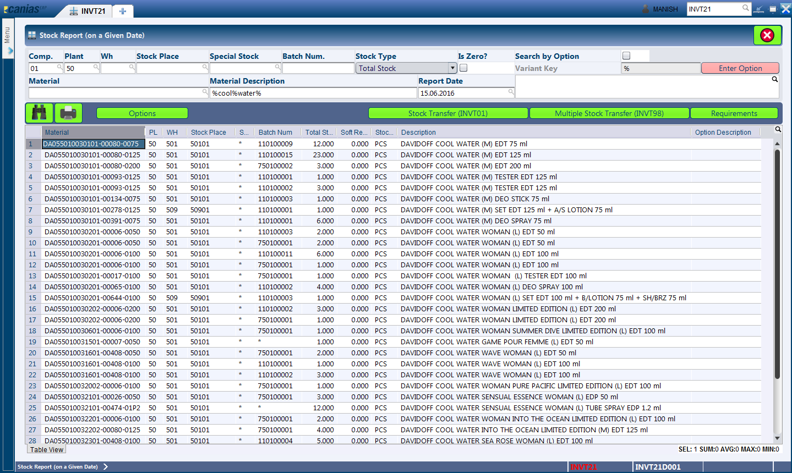
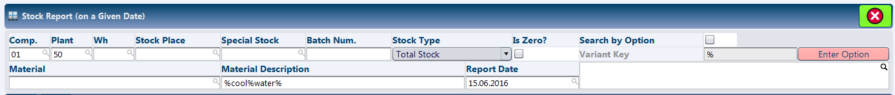
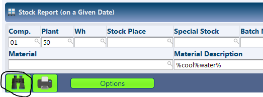
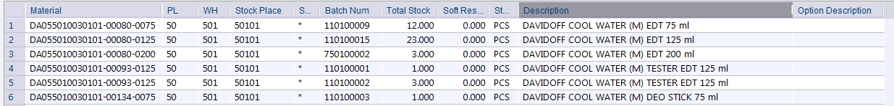

INVT21 - Stock Report
*********************

Overview
---------
INVT21 - Stock Report (on a given date), as the name suggests provides the information on the stocks at a choosen point of time. The module presents information at batch level for the materials.

Purpose
-------
* View the stocks available at a particular point of time for a group of items or a single item as required.

Filters and Shortcuts
---------------------
The module offers filters that helps define the core parameters like 'Report Date' and other parameters like material code, material name, etc. to narrow down the search results.

* **Company** - The company for which the Stock Report is to be shown.
* **Plant** - The plant for which the Stock Report is to be shown.
* **WH** - The warehouse for which the Stock Report is to be shown.
* **Stock Place** - The particular stock place for which the Stock Report is to be shown.
* **Special Stock** - The type of stock for which the Stock Report is to be shown. This field is rarely used as our stocks are always of type '*' i.e. Normal.
* **Batch Num** - The specific batch number for which the report is to be shown.
* **Stock Type** - This dropdown contains a set of different options for type of stock to be displayed.

.. image:: invt21_fitler_stocktype.PNG
    :align: center
    :scale: 65%
    :alt: INVT21 Filter for Stock Type

The normal selection for the dropdown is 'Total Stock', while the other options that could be used are 'Blocked Stock', 'Reserved Stock' where applicable.

* **Is Zero?** - Normally, the search result for the module would only include items that are currently available in stock. In case this checkbox is checked, the report displays all the items regardless of the availability of stocks.
* **Material** - The material code.
* **Material Name** - The material name. The search text for this field should be enclosed by '%' characters. For example to search for all items with 'cool water' words in it, the input should be '%cool%water%'.
* **Report Date** - This is the key input parameter to be passed, which defined the date for which the Stock Report is to be shown.

Viewing Stock Report on a Given Date
------------------------------------
* Enter the date desired in the 'Report Date' field, any other fitler parameters as required.
* Press the 'F3' button or click the 'Search' button.

Depending on the search filters provided, the system looks up the stock information and lists them in the result window.

Understanding the Result Table
------------------------------
The module always displays the details up to the batch level, with the information as explained below:

* **Material** - The material code.
* **PL** - The plant.
* **WH** - The warehouse.
* **Stock Place** - The stockplace.
* **Special Stock** - The type of stock. It is typically '*' for us.
* **Batch Num** - The batch number for the current item.
* **Total Stock** - The total stock for the current item.
* **Soft Res. Stock** - The stocks that have been 'Soft Reserved'. Typically this is not applicable to us.
* **Stock Un.** - The unit of stock. This is always 'PCS' for perfumes.
* **Description** - The name of the material.
* **Option Description** - This is always blank for us.
