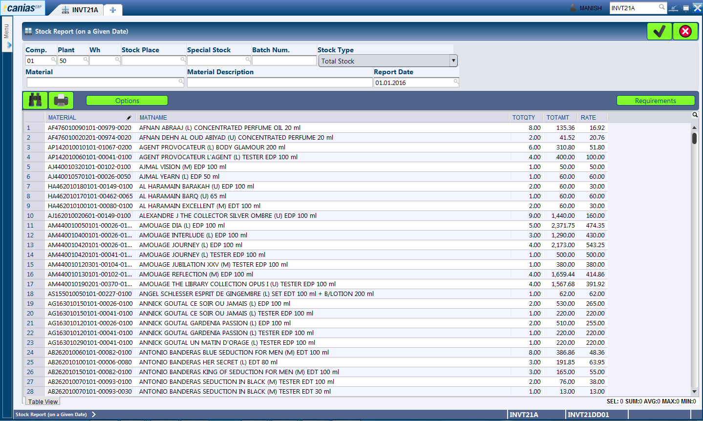
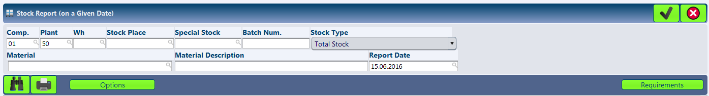
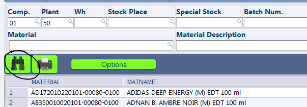
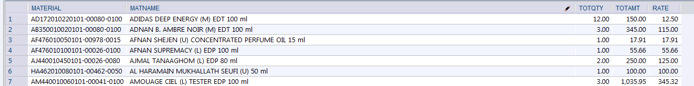
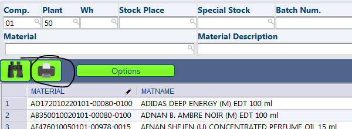

INVT21A - Stock Report (w Cost Info)
************************************

Overview
---------
INVT21a - Stock Report (w Cost Info), is a clone of INVT21 - Stock Report (on a given date) with the only different being the result set that is generated upon search. The transaction has been custom developed because of the limitation in INVT21 that it does not provide information on the cost rate, total cost of inventory at a given point of time. This report is generally available in other systems as Stock Status or Stock Summary.

Purpose
-------
* View the Quantity, Cost Rate and Total Cost of Inventory at any given point of time.

Filters and Shortcuts
---------------------
The module offers filters similar to INVT21 that includes core parameters like 'Report Date' and other parameters like material code, material name, etc. to narrow down the search results.

* **Company** - The company for which the Stock Report is to be shown.
* **Plant** - The plant for which the Stock Report is to be shown.
* **WH** - The warehouse for which the Stock Report is to be shown.
* **Stock Place** - The particular stock place for which the Stock Report is to be shown.
* **Special Stock** - The type of stock for which the Stock Report is to be shown. This field is rarely used as our stocks are always of type '*' i.e. Normal.
* **Batch Num** - The specific batch number for which the report is to be shown.
* **Stock Type** - This dropdown contains a set of different options for type of stock to be displayed. The normal selection for the dropdown is 'Total Stock', while the other options that could be used are 'Blocked Stock', 'Reserved Stock' where applicable.
* **Material** - The material code.
* **Material Name** - The material name. The search text for this field should be enclosed by '%' characters. For example to search for all items with 'cool water' words in it, the input should be '%cool%water%'.
* **Report Date** - This is the key input parameter to be passed, which defined the date for which the Stock Report is to be shown.

.. warning:: The transaction was custom developed to generate the cost rate and total cost of items from the system. The filter criterias other than material code, material name, company, plant, warehouse, stock place and batch number has not been integrated completely.

Viewing Stock Report on a Given Date
------------------------------------
* Enter the date desired in the 'Report Date' field, any other fitler parameters as required.
* Press the 'F3' button or click the 'Search' button.

Depending on the search filters provided, the system looks up the stock information and lists them in the result window.

Understanding the Result Table
------------------------------
The search results of this transaction, displayed at an material level, is fairly simple.

* **Material** - The material code.
* **Matname** - The material name / description.
* **Totqty** - The total quantity available at the selected date.
* **Totamt** - The total cost of inventory at the selected date.
* **Rate** - The cost rate of the items at the selected date.

Print Format
------------
The print format of this report can be accessed by clicking the 'Print' button visible with a 'Printer' icon.

Clicking on the 'Print' button generates a PDF File and displays it in the screen.

.. image:: invt21a_printresult.PNG
	:align: center
	:scale: 80%
	:alt: INVT05 Results 01