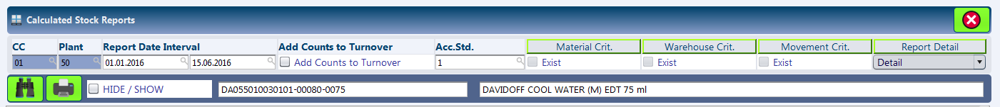
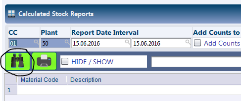
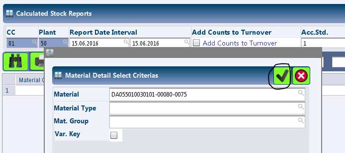
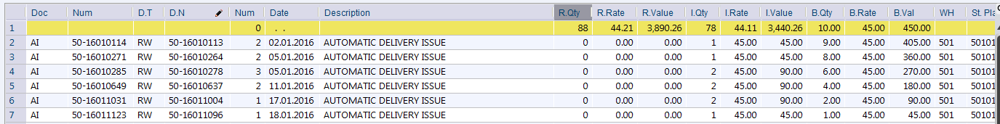
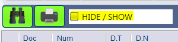

INVT22 - Calculated Stock Reports
*********************************

.. image:: invt22.PNG
    :align: center
    :scale: 65%
    :alt: INVT22 window

Overview
---------
INVT22 - Calculated Stock Reports, is an alternative to the Stock Ledger report found in most systems. The module is basically used to audit the cost of items that have been calculated for various movement types.

Purpose
-------
* Verify the current cost of the Item and Inventory Valuations.
* Analyze the cost price of the item in relation to time, supplier or other variables.

Filters and Shortcuts
---------------------
The module offers a wide range of filters to narrow down on the material, inventory location, inventory movement types, etc.

* **CC** - The company for which the Report is to be shown.
* **Plant** - The plant for which the Report is to be shown.
* **Report Date Interval** - The period for which the report is to be shown.
* **Add Counts to Turnover** - This checkbox is currently not used. Kindly leave it blank at all times.
* **Acc Std.** - A company can have multiple accounting standards to meet different reporting purposes. In case a company has multiple accounting standards, the user can select the accounting standard based on which the inventory costs is to be shown in this report. In our case, only one accounting standard has been defined for each of our companies. Hence, the field can be left as it is.

.. warning:: Although the module provides additional filters for Materials, Warehouse, Movement Criterias and Report Details, these are currently not used. The system does not display any information untill the material criteria is provided.

Generating Stock Report
-----------------------
* Enter the desired date range in the 'Report Date Interval' field, any other fitler parameters as required.
* Press the 'F3' button or click the 'Search' button.

This will bring up a dialog asking for the material code. Enter the material code and press the 'Ok' button, visible as 'Checkmark or Tick' icon.

Depending on the search filters provided, the system looks up the stock information and lists them in the result window. In case the date period has to be revised, the search button can be pressed again which refreshes the data based on new criterias.

Understanding the Result Table
------------------------------
The module always displays several columns with the information on receipt, issue and balances of the items. These have been discussed below:

* **Doc** - This is the Inventory Movement Type. For example: LI for Local Issue against Delivery Note, LR for Local Receipt against Purchase Order
* **Num** - The inventory document number.
* **D.T** - The source document type. This would be LW for LI inventory movements, PO for LR inventory movements.
* **D.N** - The source document number like Purchase Order Number or the Sales Delivery Note number.
* **Num** - Every row in the inventory movement document has a unique identification number.
* **Date** - The date of the inventory movement.
* **Description** - The description of inventory movement in text form.
* **R.Qty** - Quantity Received
* **R.Rate** - The Cost Rate for items received.
* **R.Value** - The Total Cost for items received.
* **I.Qty** - Quantity Issued
* **I.Rate** - The Cost Rate for items issued.
* **I.Value** - The Total Cost for items issued.
* **B.Qty** - The balance quantity after considering opening quantity, receipts and issues. This is a cumulative figure.
* **B.Rate** - The Cost Rate for remaining / balance quantity.
* **B.Val** - The Total Cost for remaining / balance quantity.
* **WH** - The warehouse related to the inventory movement.
* **St. Place** - The stock place related to the inventory movement.
* **Issue?** - This checkbox shows whether the inventory movement is a receipt or issue. In case it is checked it is an issue movement, else it is a receipt movement.
* **Source DT.** - The system registers a specific document type for inventory movements based on the type of source document. For example, for AI - Automatic Issue movements, the code is 6. Similarly the code for LR - Local Purchase Receipt is 2. These codes are only used for reference and generally can be ignored.

The result set also displays information on Opening Balance and the Closing Balance. These rows sum present cumulative balances in terms of quantity and total cost values.

In addition to the information above, the Customer and Vendor information can be viewed in the result set by enabling the option 'Hide / Show'.

