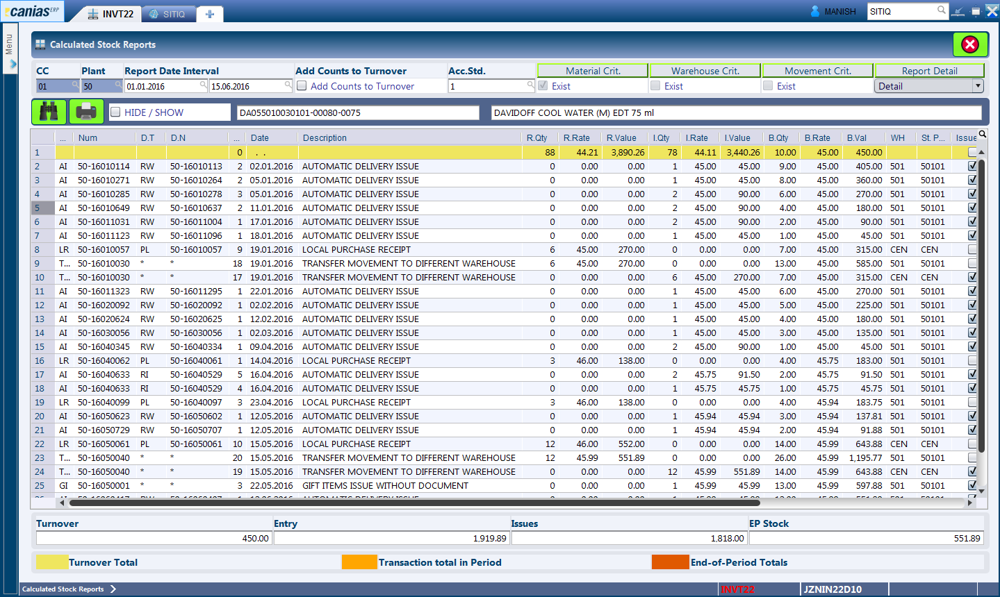

INVT22 - Calculated Stock Reports
*********************************

Overview
---------
INVT22 - Calculated Stock Reports, is an alternative to the Stock Ledger report found in most systems. The module is basically used to audit the cost of items that have been calculated for various movement types.

Purpose
-------
* Verify the current cost of the Item and Inventory Valuations.
* Analyze the cost price of the item in relation to time, supplier or other variables.

Filters and Shortcuts
---------------------
The module offers a wide range of filters to narrow down on the material, inventory location, inventory movement types, etc.

.. image:: invt22_filters.PNG
    :align: center
    :scale: 65%
    :alt: INVT22 Filters

* **CC** - The company for which the Report is to be shown.
* **Plant** - The plant for which the Report is to be shown.
* **Report Date Interval** - The period for which the report is to be shown.
* **Add Counts to Turnover** - This checkbox is currently not used. Kindly leave it blank at all times.
* **Acc Std.** - A company can have multiple accounting standards to meet different reporting purposes. In case a company has multiple accounting standards, the user can select the accounting standard based on which the inventory costs is to be shown in this report. In our case, only one accounting standard has been defined for each of our companies. Hence, the field can be left as it is.

.. warning:: Although the module provides additional filters for Materials, Warehouse, Movement Criterias and Report Details, these are currently not used. The system does not display any information untill the material criteria is provided.

Generating Stock Report
-----------------------
* Enter the desired date range in the 'Report Date Interval' field, any other fitler parameters as required.
* Press the 'F3' button or click the 'Search' button.

This will bring up a dialog asking for the material code. Enter the material code and press the 'Ok' button, visible as 'Checkmark or Tick' icon.

.. image:: invt22_matcri.PNG
    :align: center
    :scale: 80%
    :alt: Date Shortcuts

Depending on the search filters provided, the system looks up the stock information and lists them in the result window. In case the date period has to be revised, the search button can be pressed again which refreshes the data based on new criterias.

Understanding the Result Table
------------------------------
The module always displays several columns with the information on receipt, issue and balances of the items. These have been discussed below:

