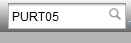
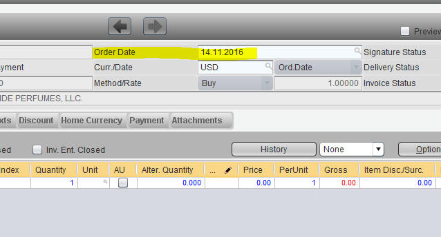

PURCHASE PROCESS - Recording a Purchase Order
*********************************************

Module
---------
Purchase Order is created using 'PURT05'

Step by Step Process
--------------------

1. Open 'PURT05' - Purchase Orders

2. Click on the '+' button to create a new order.

	.. note:: Make sure that no documents are selected when clicking the '+' button. In case any purchase order is selected while clicking the button, the system copies all the items from the selected purchase order to the new purchase order. This is referred as 'Creation of Purchase Order by Reference' and comes handly when copying the items from purchase orders.

3. The system opens a new dialog. Click on the 'Zoom' icon next to the Vendor field to open the supplier selection dialog:

4. Type in any part of the supplier name enclosed by '%' sign and click on the search icon.:

5. Select the row of the correct supplier and press the checkmark button.

	.. note:: In cases where the supplier code is not available in the system, kindly contact the back office for the creation of the supplier record.

6. Ensure that the Company is set to '02' and Business Area (BA) to '60'.

7. Choose the appropriate Order Type: PL for Local Purchases and PI for Import Purchaess. Selection can be made by clicking on the zoom icon near to the Order Type field.

8. Click on the checkmark icon to proceed. This opens up a new dialog.

9. Choose the Appropriate Purchase Order date.

10. We now need to add the items to the Purchase Order. To add an item to the order, click on the 'Zoom' icon in the Material column. This opens up a new window for Material Selection.

11. Type in the part of the product name in the description field, enclosed with '%'. Click on the search button to search.

12. Select the row for the desired item in the search results, and press the checkmark button to add the item to the purchase order.

	.. note:: In cases where the item is new, the material code might not be available in the system for selection. In this case, kinldy contact the back office with the product details (preferably with the EAN Code) for creation of the material code in system.

13. Enter the Quantity and Price in the respective fields.

14. To add more rows to the purchase order, select the first row, and hit the 'Insert' key on your keyboard. This adds a new line to the purchase order.

15. Select the desired item, and input the quantity and prices by repeating the steps from 10 to 13.

16. Provide the reference of the Supplier's Invoice in Notes. To do this, navigate to the 'Texts' tab.

17. Provide the reference in the 'Notes' field.

18. Verify the items, quantities and totals.

19. Click on the 'Save' button to save the Purchase Order.

20. The system returns a message that the Purchase Order was successfully created.

21. The purchase order can now be seen in the Purchae Order list. Click on the 'Search' button to view the list.

22. To print the Purchase Order, select the row of the document, click on the dropdown icon next to the 'Print' button, and select 'As Order'.

