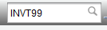
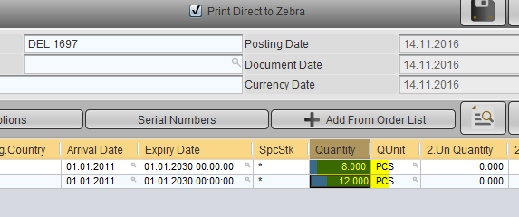
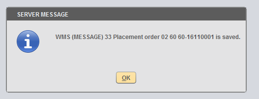

PURCHASE PROCESS - Receipt of the Goods
***************************************

Module
---------
This process is initiated after the goods from a Purchase Order has been received in the warehouse, and the Goods Receipt Note (GRN) has already been prepared. Only after the receipt of items from INVT01, the received quantities will be available in the system.

Step by Step Process
--------------------

1. Open 'INVT01' - Inventory Documents

2. Select '02' as the company, '60' as the plant and 'CEN' as the warehouse.

.. note:: Choose the company, plant and warehouse in order, as the sytem populates other dropdowns based on the earlier selection.

3. In the stock movement selection, choose 'Receipt' and 'Purchase Order' respectively.

4. Provide the supplier code in the 'Vendor' input field. The vendor code can be referred from the Purchase Order document in PURT05.

5. Provide the date of goods receipt in the Document Date. This automatically updates the Posting Date and Currency date also.

.. note:: The Goods Receipt date cannot be earlier than the Purchase Order date.

6. Click on the checkmark button to continue. This opens up a new dialog.

7. The new dialog lists all items that are yet to be received from the particular vendor. To view the list, click on the search button.

.. note:: The dialog lists all items that are yet to be received from the vendor, regardless of the purchase order document.

8. Select the items that we have received (as seen in GRN).

.. image:: step008.PNG
	:align: center
	:scale: 75%
	:alt: FINT89 Filters

9. Click on the checkmark button to continue.

10. There are high chances that the system will throw a "There's no defined stockplace for material {{material code}}!" error message. This indicates that the item is not linked with any of the stockplaces in the system. To fix this, we would have to link the items to the stock places using INVT99. Continue to step 11 directly in case there are no error messages.

.. image:: step010.PNG
	:align: center
	:scale: 75%
	:alt: FINT89 Filters

10.1 Open INVT99.

10.2 Select the Company as 02, and Plant as 60. Even if the fields are already set to 02 and 60, we need to select the company and plant for the system to automatically fetch the stockplaces.

10.3 The system lists the stockplaces in the left table.

10.4 Copy the Materials which are to be linked, from either INVT01 or PURT05 to the material column of the right table.

10.5 Ensure that the Valid From and Valid Until dates are set to 01.01.2011 and 31.01.2030 for all items. Click the checkmark button to begin the process.

10.6 The system generates a success message after the items are linked. Now continue with the INVT01 process to receive the items.

11. Provide the description of the document : ex."RECEIPT AGAINST PI#60-16110001"

12. Provide the Delivery Note reference in the Delivery Note input field. This field is mandatory.

13. Verify the quantities with the GRN. If the quantities in GRN is different, change the quantity to match the GRN.

14. Remove the 'Print Directly to Zebra' checkmark, and click the 'Save' button.

15. The system generates success messages for placement order and the inventory document.

16. Press the Cancel button when prompted to Print the Labels.

17. The system automatically generates the PDF file for goods receipt, which can be printed or saved as PDF.

