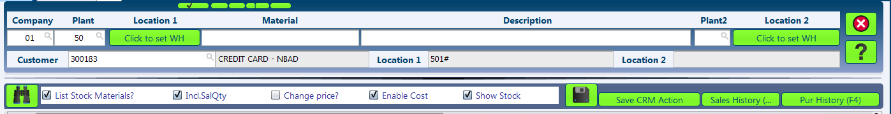
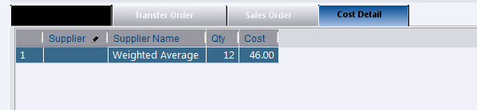
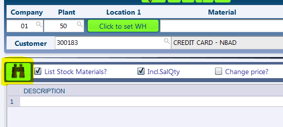
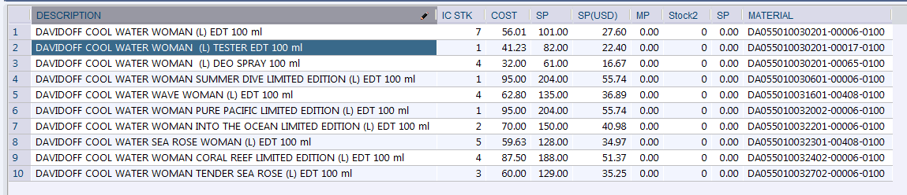
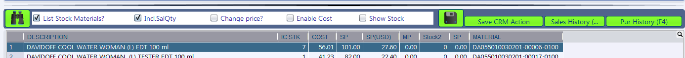
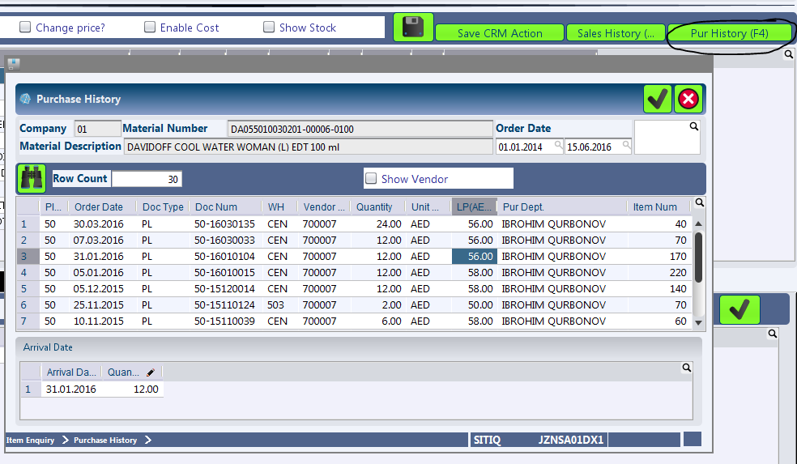
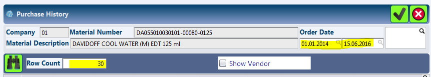
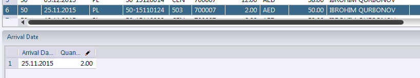
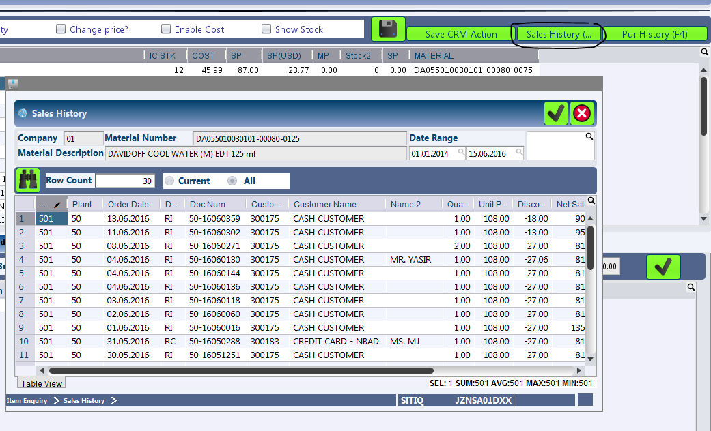
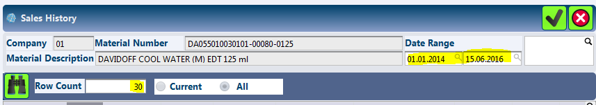

SITIQ - Item Enquiry
********************

.. image:: sitiq.png
    :align: center
    :scale: 65%
    :alt: SITIQ window

Overview
---------
SITIQ is the abbreviated word for Sales Item Enquiry. The module was initiated to centralize the most common operations from the shop side like 'Creation of Sales Orders', 'Transfer of Stocks (Intra and Inter Company)' together with the stock status report. Comprehensive details on the purpose of the module has been discussed in the following section.

Purpose
-------
* Central view of the inventory across multiple plants, with quick access to 'Sales History', 'Purchase History' & 'Item Master'
* Shortcut to creation of sales orders
* Creation of transfer orders (within the same plant or among different plants)

Filters and Shortcuts
---------------------
The module includes filters primarily aimed at narrowing down the list of items fetched by the system.

* **Company** - Company for which the information is to be displayed.
.. _filter-plant1:

* **Plant** - The plant for which the information is to be displayed. This can be referred as Plant 1.

* **Location1** - This button opens up a dialog to filter for the Warehouses available to the selected plant and company. Multiple selections can be made.

.. image:: filter_location.PNG
	:align: center
	:scale: 80%
	:alt: SITIQ window

* **Material** - Filter that accepts the Material Code as input.

* **Material Name** - This is the filter which accepts the material name (or part of it) as input.

	.. note:: This is the most common filter used in the transaction, and can be used as a handy shortcut to quickly find items.

	* Any part of the name can be used. For example: 'cool water' when searching for 'DAVIDOFF COOL WATER (L) EDT 100 ml'
	* The system automatically convers blank spaces to '%' allowing easy search. For example 'cool water 100' will yeild results with all cool water items of size 100ml. Similarly 'c w 100' would yeild the results of items which have c, w and 100 characters in them.
.. _filter-plant2:

* **Plant2** - This is used when the inventory data is to be compared against multiple plants. If this field is provided, the system shows results for both plant 1 and plant 2, in separate columns. Also, the inter plant selling price is shown if defined.

* **Location2** - This is the filter for warehouses that belong to Plant2. Similar to Plant1, multiple selections can be made.
.. _filter-customer:

* **Customer** - This filter is more of a parameter to the process of creating sales orders. In case prices have been customized per user, this filter determines which price is shown in the SP (Selling Price) field of the result table.

In addition to the filters discussed above, there are checkbox filters that controls the visibility of information in SITIQ.

.. info:: These checkboxes might not be available to all users because of the access rights.

* **List Stock Materials?** - If the checkbox is selected, the system only displays items which we currently have in stock in the selected plant / warehouse. To view all items, simply uncheck this checkbox.
.. _checkbox-salqty: 

* **Incl. SalQty** - The sales orders created in canias do not reflect in the inventory side untill the delivery note is created and the items are issued out. In this case, the default list shown in SITIQ would display full stock of items, without considering those already created sales orders. This checkbox allows the user to view the net stock for items (available stock - stocks used in current sales orders). Click the checkbox to view Net Quantity, and remove the checkmark to view Gross Quantity.

* **Change Price?** - This button is a support to the process 'Changing System Selling Price'. Clicking the button shows an additional column in the result table for editing of the system selling prices.

* **Enable Cost** - This checkbox serves as user access control for display of cost related information for the item. If this checkbox is selected, the fourth tab in the lower section of the screen becomes active. This tab displays weighted average cost rate for the item that is currently selected in the result table.

* **Show Stock** - This checkbox serves as user access control for display of stocks across all companies and plants in canias. If this checkbox is selected, the first tab in the lower part of screen becomes active. This tab displays the availability of selected item from the result set in all plants and warehouse.

Searching for Items
-------------------
* Enter the required filter criterias in the filter boxes. Most commonly the filters would be entered in the 'Description' field where any part of the name of the item is entered.
* Press the 'F3' button or click the 'Search' button.

Depending on the search filters provided, the system looks up the stock information and lists them in the result window.

Understanding the Result Table
------------------------------
The result table in SITIQ displays key information related to the item, which as been discussed below:

* **Description** - This column displays the name of the Material.

* **STK** - The second column displays the available stock for the items in :ref:`Plant 1<filter-plant1>`. The result in this column varies with the filter checkbox 'Incl. SalQty' as described :ref:`here<checkbox_salqty>`. The title for this column is dynamic with the following pattern 'Short Name of Plant' + STK.

* **Cost** - The pack price of the item. 'Pack Price' is a customized development in Canias, which is meant to replace the Cost Price. Although this value is the same as the 'Cost Price', it can be modified to present a value different from the Cost Price.

* **SP** - The Selling Price of the item. This column depends on the Customer that is currently selected as described :ref:`here<filter-customer>`.

* **SP(USD)** - The Selling Price of the item in USD.

* **MP** - The Market Price of the Item. This information might not be available for all items as the source for this is manual input only.

* **Stock2** - The available stock for items in :ref:`Plant 2<filter-plant2>`.

* **SP** - The price at which the items are meant to be sold from :ref:`Plant 2<filter-plant2>` to :ref:`Plant 1<filter-plant1>`. This price is used when creating inter-company tranfers, if available.

* **Material** - The material code for the item.

Purchase and Sales History
--------------------------
The module provides quick access to the Purchase and Sales History for any item. To view the sales or purchase history, select the row for the specific item in the result table:

Purchase History
^^^^^^^^^^^^^^^^
Purchase History for the selected item can be viewed by clicking on the 'Purchase History' button or by pressing the 'F4' key in the keyboard.

The purchase history dialog displays the last 30 purchase transactions for the selected item. Order Date range can be provided in the dialog box to search for the transactions within a specific period. Also, the number of rows displayed can be set by typing in the desired number in Row Count field.

The fields displayed in the result set for Purchase History has been discussed below:

* **Plant** - The plant related to the purchase.
* **Order Date** - The date when Purchase Order was raised.
* **Doc Type** - The purchase order type. This is typically PL for Local Purchases and PI for Import Purchases.
* **Doc Num** - The document number for the purchase order.
* **WH** - The warehouse as defined in the purchase order document.
* **Vendor** - The Vendor Code for the purchase.
* **Vendor Name** - The name of the Vendor.
* **Quantity** - Quantity of Items Purchased.
* **Unit** - The currency unit for the purchase.
* **LP(AED)** - The price of the item.
* **Pur Dept** - The purchaser, as defined in the purchase order.
* **Item Num** - Every item in the purchase order is provided a unique identification number called 'Item Num'.

.. note:: The 'Vendor Name' field is only displayed if the Show Vendor button is checked. The visibility of this checkbox might differ based on user access rights.

In addition to the information above, the purchase history dialog also allows the user to track the arrival date of the item. This can be seen in the lower part of the purchase history dialog after a row of purchase history has been selected.

Sales History
^^^^^^^^^^^^^
Sales History for the selected item can be viewed by clicking on the 'Sales History' button or by pressing the 'F2' key in the keyboard.

The sales history dialog displays the last 30 sales transactions for the selected item. Order date range can be provided in the dialog box to search for sales transactions within a specific period. Also, the number of rows displayed can be set by typing in the desired number in Row Count field.

The fields displayed in the result set for Sales History has been discussed below:

* **Warehouse** - The warehouse from which the items are to be issued out.
* **Plant** - The plant to which the sale relates to.
* **Order Date** - The Sales Order date.
* **Doc Type** - The sales document type. Typical documents are RI - Retail Invoice, LO - Local Sales Order, EO - Export Sales Order
* **Doc NUm** - The sales order document number.
* **Customer Code** - The customer for whom the sales order was made.
* **Customer Name** - The customer name defined in the system.
* **Name2** - The seconday name field for Customer. This is particularly used when an account has not been created in the customer and a generic account like 'Miscellaneous Customer', 'Temporary Customer', 'Cash Customer', 'Credit Card Customer', etc is used. This field is manually entered by the person who is creating the sales order.
* **Quantity** - The quantity of the item sold in the particular sales order.
* **Unit Price** - Unit price of the item (before discount).
* **Discount** - Total discount provided for the item (item level discount + allocation of header level discount).
* **Net Sale** - Unit price of the item (after discount).
* **Unit Curr** - The sales currency for the sales order.
* **Sales Dept** - The salesman who created the sales order.
* **Item Num** - The item number reference is assigned to each material inside a sales order.

Creating Sales Orders
---------------------
This section describes how the sales order can be created.

.. note:: This section shall be updated during the creation of guide for 'SALT01 - Sales Documents'.

Creating Transfer Orders
------------------------
This section describes how the transfer orders can be created.

.. note:: This section shall be updated in the future.