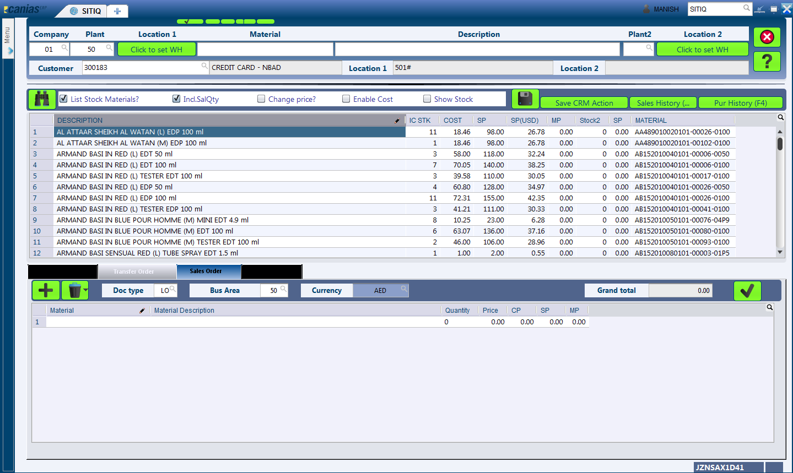
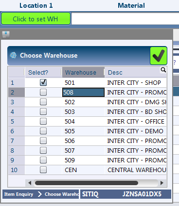

SITIQ - Item Enquiry
********************

Overview
---------
SITIQ is the abbreviated word for Sales Item Enquiry. The module was initiated to centralize the most common operations from the shop side like 'Creation of Sales Orders', 'Transfer of Stocks (Intra and Inter Company)' together with the stock status report. Comprehensive details on the purpose of the module has been discussed in the following section.

Purpose
-------
* Central view of the inventory across multiple plants, with quick access to 'Sales History', 'Purchase History' & 'Item Master'
* Shortcut to creation of sales orders
* Creation of transfer orders (within the same plant or among different plants)

SITIQ Screen
------------
The SITIQ screen is divided into three parts:

* Filters and Shortcuts

	* The module includes following filters.

		* **Company** - Company for which the information is to be displayed.
		* **Plant** - The plant for which the information is to be displayed.
		* **Location1** - This button opens up a dialog to filter for the Warehouses available to the selected plant and company. Multiple selections can be made.

		* **Material** - Filter that accepts the Material Code as input.
		* **Material Name** - This is the filter which accepts the material name (or part of it) as input. This is the most common filter used in the transaction, and can be used as a handy shortcut to quickly find items. This has been discussed in detail below:

			* Any part of the name can be used. For example: 'cool water' when searching for 'DAVIDOFF COOL WATER (L) EDT 100 ml'
			* The system automatically convers blank spaces to '%' allowing easy search. For example 'cool water 100' will yeild results with all cool water items of size 100ml. Similarly 'c w 100' would yeild the results of items which have c, w and 100 characters in them.

		* **Plant2** - This is used when the inventory data is to be compared against multiple plants. If this field is provided, the system shows results for both plant 1 and plant 2, in separate columns. Also, the inter plant selling price is shown if defined.
		* **Location2** - This is the filter for warehouses that belong to Plant2. Similar to Plant1, multiple selections can be made.
		* **Customer** - This filter is more of a parameter to the process of creating sales orders. In case prices have been customized per user, this filter determines which price is shown in the SP (Selling Price) field of the result table.

* Result Table
* Processes (Sales / Transfer) and Additional Information

Creating Sales Orders
---------------------
This section describes how the sales order can be created.

Creating Transfer Orders
------------------------
This section describes how the transfer orders can be created.